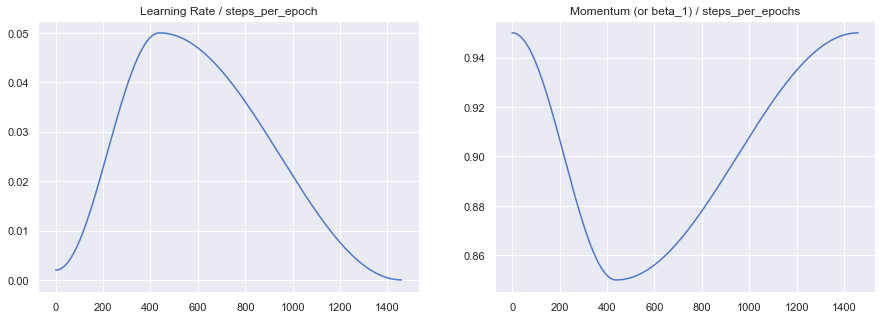
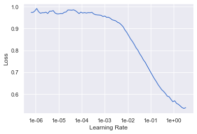
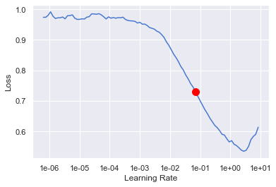

# one_cycle_lr-tensorflow: 

## Installation:

   Ensure that `python >= 3.6` is installed.
   ```bash
   $ git clone https://github.com/benihime91/one_cycle_lr-tensorflow.git
   $ cd one_cycle_lr-tensorflow
   $ pip install -r requirements.txt
   ```
## Demo:
[JupyterNotebook](https://github.com/benihime91/tensorflow-on-steroids/blob/master/nbs/one_cycle_%26_lr_finder_tf.ipynb).

## Important :
LrFinder does not support TPU training .

## Contents:  

1. **OneCycleLR learning rate scheduler** 
   
   [Source](https://github.com/benihime91/tensorflow-on-steroids/blob/master/one_cycle.py)
   
   **Example :** 
   ```python

   # Import `OneCycleLr`
   from one_cycle import OneCycleLr

   # Configs
   max_lr = 5e-02
   epochs = 5

   # Istantiate `OneCycleLr`
   one_c = OneCycleLr(max_lr=max_lr, steps_per_epoch=len(trn_ds), epochs=epochs)

   # Instantiate CallbackList
   cbs = [one_c, ...]

   # Instantiate Optimizer & loss_fn
   optim = keras.optimizers.SGD(momentum=0.9, clipvalue=0.1)
   loss_fn = ...

   # Compile Model
   model.compile(optimizer=optim, loss=loss_fn, metrics=["acc"])

   # Fit Model
   h = model.fit(trn_ds, validation_data=val_ds, epochs=epochs, callbacks=cbs)
   ```
   
   **To view the learning_rate and momentum plots:**
   
   ```python
   # to plot the learning_rate & momentum(or beta_1) graphs
   one_c.plot_lrs_moms()
   ```
   
     


2. **Learning Rate Finder** 
   
   [Source](https://github.com/benihime91/tensorflow-on-steroids/blob/master/lr_find.py)

   **Example:**
   ```python
   # Import LrFinder
   from lr_find import LrFinder

   # Instantiate Optimizer & loss_fn 
   # [must be instance of tf.keras.Optimizers & tf.keras.Losses]
   optimizer = ...
   loss_fn = ...

   # Instantiate LrFinder
   lr_find = LrFinder(model, optimizer, loss_fn)

   # Start range_test
   lr_find.range_test(trn_ds)
   ```
   **To view `lr_finder` plots:**
   ```python
   # Plot LrFinder graphs
   lr_find.plot_lrs()
   ```
   
   
   **To view `lr_finder` plots with suggestion:**
   ```python
   # Plot LrFinder graphs
   lr_find.plot_lrs(skip_end=0, suggestion=True)
   ```
   


## Information:

1. **OneCycleLR learning rate scheduler:**
   - Sets the learning rate of each parameter group according to the 1cycle learning rate policy. The 1cycle policy anneals the learning rate from an initial learning rate to some maximum learning rate and then from that maximum learning rate to some minimum learning rate much lower than the initial learning rate. This policy was initially described in the paper [Super-Convergence: Very Fast Training of Neural Networks Using Large Learning Rates](https://arxiv.org/abs/1708.07120) and popularized by [fast.ai](https://www.fast.ai/).

   - The 1cycle learning rate policy changes the learning rate after every batch.
   
   - Note also that the `total number of steps` in the cycle can be determined in one of two ways (listed in order of precedence):

      - A value for `total_steps` is explicitly provided.

      - A number of `epochs (epochs)` and a number of `steps per epoch (steps_per_epoch)` are provided. In this case, the number of `total steps` is inferred by `total_steps = epochs * steps_per_epoch`.

      You must either provide a value for total_steps or provide a value for both epochs and steps_per_epoch.
   
   - **OneCycleLR callback arguments:**
   
       - **max_lr** (`float`): Upper learning rate boundaries in the cycle.
       - **total_steps** (`int`): The total number of steps in the cycle. Note that
               if a value is not provided here, then it must be inferred by providing
               a value for epochs and steps_per_epoch.
               Default: None
       - **epochs** (`int`): The number of epochs to train for. This is used along
               with steps_per_epoch in order to infer the total number of steps in the cycle
               if a value for total_steps is not provided.
               Default: None
       - **steps_per_epoch** (`int`): The number of steps per epoch to train for. This is
               used along with epochs in order to infer the total number of steps in the
               cycle if a value for total_steps is not provided.
               Default: None
       - **pct_start** (`float`): The percentage of the cycle (in number of steps) spent
               increasing the learning rate.
               Default: 0.3
       - **anneal_strategy** (`str`): {'cos', 'linear'}
               Specifies the annealing strategy: "cos" for cosine annealing, "linear" for
               linear annealing.
               Default: 'cos'
       - **cycle_momentum** (`bool`): If ``True``, momentum is cycled inversely
               to learning rate between 'base_momentum' and 'max_momentum'.
               Default: True
       - **base_momentum** (`float`): Lower momentum boundaries in the cycle
               for each parameter group. Note that momentum is cycled inversely
               to learning rate; at the peak of a cycle, momentum is
               'base_momentum' and learning rate is 'max_lr'.
               Default: 0.85
       - **max_momentum** (`float or list`): Upper momentum boundaries in the cycle
               for each parameter group. Functionally,
               it defines the cycle amplitude (max_momentum - base_momentum).
               Note that momentum is cycled inversely
               to learning rate; at the start of a cycle, momentum is 'max_momentum'
               and learning rate is 'base_lr'
               Default: 0.95
       - **div_factor** (`float`): Determines the initial learning rate via
               initial_lr = max_lr/div_factor
               Default: 25
       - **final_div_factor** (`float`): Determines the minimum learning rate via
               min_lr = initial_lr/final_div_factor
               Default: 1e4

2. **Learning_rate Finder:**

   - For training deep neural networks, selecting a good learning rate is essential for both better performance and faster convergence. Even optimizers such as Adam that are self-adjusting the learning rate can benefit from more optimal choices.

   - To reduce the amount of guesswork concerning choosing a good initial learning rate, a learning rate finder can be used. As described in this [paper](https://arxiv.org/abs/1506.01186) a learning rate finder does a small run where the learning rate is increased after each processed batch and the corresponding loss is logged. The result of this is a lr vs. loss plot that can be used as guidance for choosing a optimal initial lr.
   
   - **Arguments to Initialize LrFinder class:**
      - **model** (`tf.keras.Model`): wrapped model
      - **optimizer** (`tf.keras.optimizers`): wrapped optimizer
      - **loss_fn** (t`f.keras.losses`): loss function
   
   - **Arguments to start range test:**
      - **trn_ds** (`tf.data.Dataset`): the train dataset.
      - **start_lr** (`float, optional`): the starting learning rate for the range test.
                Default:1e-07.
      - **end_lr** (`float, optional`): the maximum learning rate to test. Default: 10.
      - **num_iter** (`int, optional`): the number of steps over which the test
                occurs. Default: 100.
      - **beta** (`float, optional`): the loss smoothing factor within the [0, 1]
                interval. The loss is smoothed using exponential smoothing.
                Default: 0.98.


## References & Citations:
   ```
   @misc{smith2015cyclical,
       title={Cyclical Learning Rates for Training Neural Networks},
       author={Leslie N. Smith},
       year={2015},
       eprint={1506.01186},
       archivePrefix={arXiv},
       primaryClass={cs.CV}
   }
   ```
   ```
   @misc{howard2018fastai,
     title={fastai},
     author={Howard, Jeremy and others},
     year={2018},
     publisher={GitHub},
     howpublished={\url{https://github.com/fastai/fastai}},
   }
   ```
   ```
   @incollection{NEURIPS2019_9015,
   title = {PyTorch: An Imperative Style, High-Performance Deep Learning Library},
   author = {Paszke, Adam and Gross, Sam and Massa, Francisco and Lerer, Adam and Bradbury, James and Chanan, Gregory and Killeen, Trevor and Lin, Zeming and Gimelshein, Natalia and Antiga, Luca and Desmaison, Alban and Kopf, Andreas and Yang, Edward and DeVito, Zachary and Raison, Martin and Tejani, Alykhan and Chilamkurthy, Sasank and Steiner, Benoit and Fang, Lu and Bai, Junjie and Chintala, Soumith},
   booktitle = {Advances in Neural Information Processing Systems 32},
   editor = {H. Wallach and H. Larochelle and A. Beygelzimer and F. d\textquotesingle Alch\'{e}-Buc and E. Fox and R. Garnett},
   pages = {8024--8035},
   year = {2019},
   publisher = {Curran Associates, Inc.},
   url = {http://papers.neurips.cc/paper/9015-pytorch-an-imperative-style-high-performance-deep-learning-library.pdf}
   }
  ```
